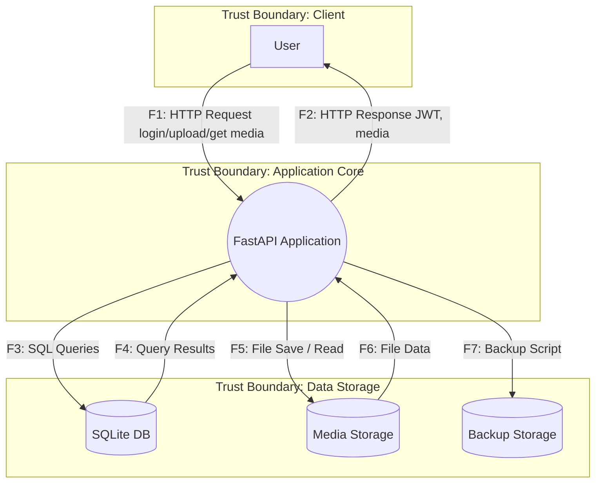

```mermaid
flowchart TB
    %% Trust Boundaries
    subgraph ClientZone [Trust Boundary: Client]
        U[User]
    end

    subgraph CoreZone [Trust Boundary: Application Core]
        P0((FastAPI Application))
    end

    subgraph DataZone [Trust Boundary: Data Storage]
        D[(SQLite DB)]
        M[(Media Storage)]
        B[(Backup Storage)]
    end

    %% Data Flows
    U -->|F1: HTTP Request login/upload/get media| P0
    P0 -->|F2: HTTP Response JWT, media| U

    P0 -->|F3: SQL Queries| D
    D -->|F4: Query Results| P0

    P0 -->|F5: File Save / Read| M
    M -->|F6: File Data| P0

    %% Alternative scenario: Backup
    P0 -->|F7: Backup Script| B
```
